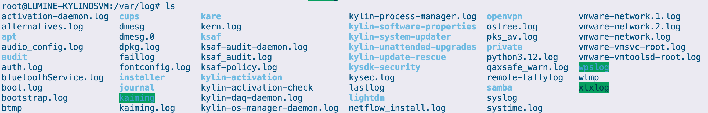
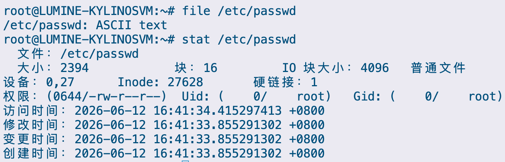

# 文件快速定位与管理

## 实验目的

1. 理解命令 `find`、`grep` 的应用场景
2. 理解 `cat`、`less`、`more`、`head`、`tail` 等命令查看文件的区别
3. 掌握 `file` 命令与 `state` 命令的使用

## 实验内容及要求

1．用 `find` 命令查找 `/usr` 目录中文件名里含有 `pass` 字符的文件。

2．在 `/dev` 目录下查找所有 `sd` 开头的块设备文件。

3．查找目录 `/etc` 中所有文件长度为 0 的普通文件，并显示它们详细格式目录。

4．查找 `/usr` 目录中名字为 `kmod-protect.list` 的文件，并分页显示这个文件的内容。

5．显示文件 `/etc/passwd` 中以 `nologin` 结尾的行内容。

6．查看最近更新的系统日志记录信息

7．查看 `/etc/passwd` 文件的文件类型，及文件系统信息。

## 实验步骤

使用命令查找 `/usr` 中文件名带有 `pass` 字符的文件，运行以下命令即可

```bash
$ find /usr -name "*pass*"
```


接着在 `/dev` 目录中寻找 `vd` 开头的块设备文件，使用 `-type b` 做类型限定即可

```bash
$ find /dev -name "vd*" -type b 
```

然而并没有找到，按照我的电脑来找好了，条件改成 `nvme*`

```bash
$ find /dev -name "nvme*" -type b
```


要查找 `/etc` 中长度为 0 的普通文件，并显示其详细格式目录，跑一下命令就好，`-type f` 限定普通文件，`-size 0` 指定文件大小，再将对应的文件运行命令 `ls -l` 即可，这里 `-exec ls -l {} \;` 中，`{}` 是占位符，会被各种文件的路径替代，然后用 `\;` 终止 `-exec` 的命令参数就行了

```bash
$ find /etc -type f -size 0 -exec ls -l {} \;
```


查找文件 `/etc/passwd` 中 `nologin` 结尾的行内容，需要用 `grep`，传入对应的参数 `nologin$` 就可以了，用 `$` 表示结尾

```bash
$ cat /etc/passwd | grep "nologin$"
```


获取最近系统的日志，直接读 `/var/log/messages`，使用 `tail` 可以只读取结尾行

但其实我系统里没这个文件



那就随便读取一个吧，直接来读内核日志 `kern.log`


查看 `/etc/passwd` 的文件类型和文件系统信息，分别用到的是 `file` 和 `stat`

```bash
$ file /etc/passwd
$ stat /etc/passwd
```



## 实验小结

通过本次实验，系统掌握了 Linux 环境下多种文件查找、内容过滤及状态查看工具的使用方法，深入理解了不同命令的应用场景与差异