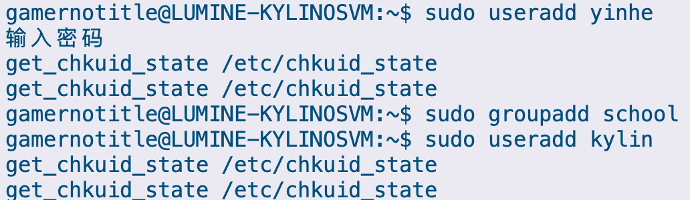
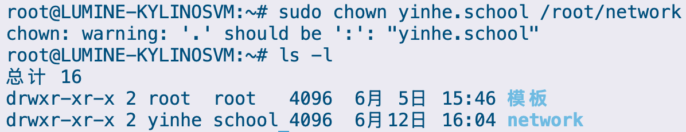
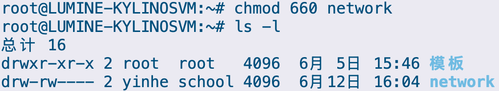
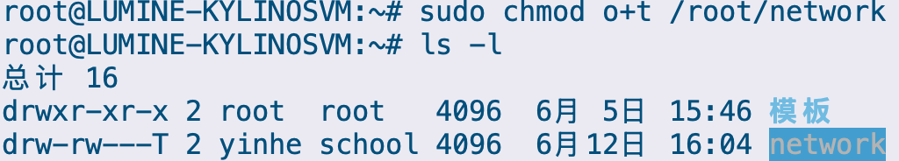
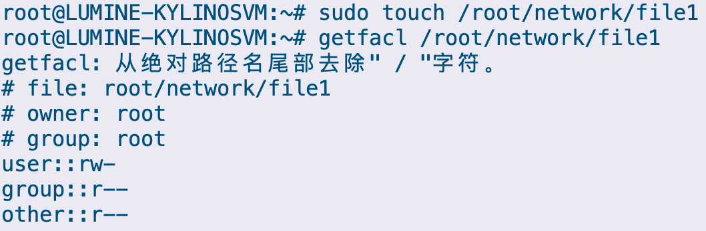
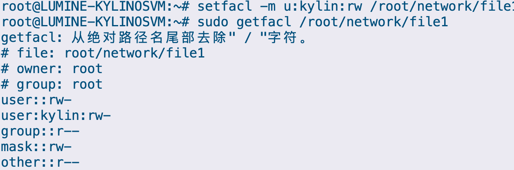

# 多用户与权限管理

## 实验目的

1. 理解文件权限作用。
2. 熟悉麒麟系统下文件特殊权限应用场景。
3. 掌握文件特殊权限设置。

## 实验内容及要求

在麒麟服务器系统上/root/network 的拥有者为 yinhe，预开放该目录为 school  工作组的共享目录，组成员可在目录内有读写权限，但不能随意删除同组成员的文件。该目录下的 file1 文件对 kylin 用户开放读写权限。

## 实验步骤

### 设置目录 `/root/network` 的拥有者为 `yinhe`，所属组为 `school`，该目录权限为 `660`。

运行命令创建对应的用户和组别

```bash
$ sudo useradd yinhe
$ sudo groupadd school
$ sudo useradd kylin
```



接着创建一个目录 `/root/network`

```bash
$ sudo mkdir /root/network
```

修改 `/root/network` 的拥有者和拥有组

```bash
$ sudo chown yinhe.school /root/network
```

通过 `ls -l` 查看，发现已经完成了变更



接着设置目录权限

```bash
$ sudo chmod 660 network
```

再次进行查看，发现此时的权限已经为 `drw-rw----`



### 对于 `/root/network` 目录下所有文件， 除了拥有者本人和 `root` 用户外其他人无法删除别人的文件

运行命令

```bash
$ sudo chmod o+t /root/network
```

再进行查看，此时发现已经带有 `T` 标识符了

> [!important]
> 
> **对  `T` 的说明，参考的时候不用丢进去**
>
> 此处的 `T` 是粘滞位，因为在后三位，所以是对于非前面用户（组）的所有用户（不包含 `root`，`root` 具有最高权限），`T` 除了授权用户，不可修改、不可删除此目录及其子目录下的任何文件
>
> 如果是 `t`，此时是允许执行的



### 设置 `/root/network/file1` 文件的 ACL 扩展权限，使得 `kylin` 用户对文件 `file1` 具有读和写的权限

首先先创建一下这个文件

```bash
$ sudo touch /root/network/file1
```

然后获取一下这个文件的 ACL 权限

```bash
$ sudo getfacl /root/network/file1
```



按照要求设置一下

```bash
$ sudo setfacl -m u:kylin:rw /root/network/file1
```

然后重新获取一下权限看看

```bash
$ sudo getfacl /root/network/file1
```



此时发现用户 `kylin` 对于文件 `root/network/file1` 具有了 `rw` 权限

## 实验小结

通过本次实验，深入理解了 Linux 系统下文件及目录的权限控制机制，特别是特殊权限和扩展权限的实际应用场景，掌握了 `chown`、`chmod`、`chmod o+t`、`setfacl`、`getfacl` 等命令的使用
