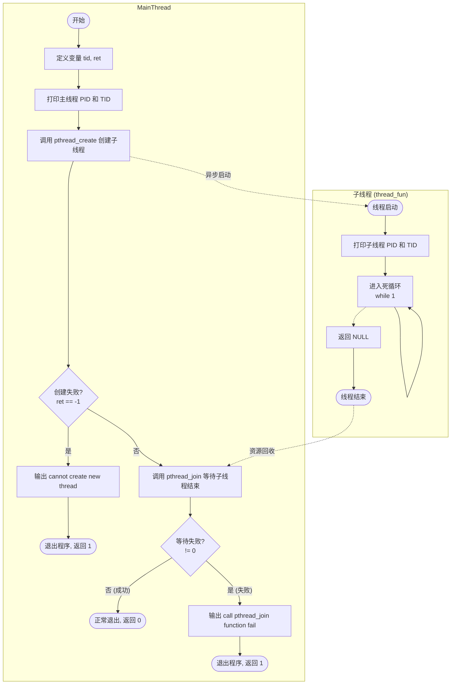
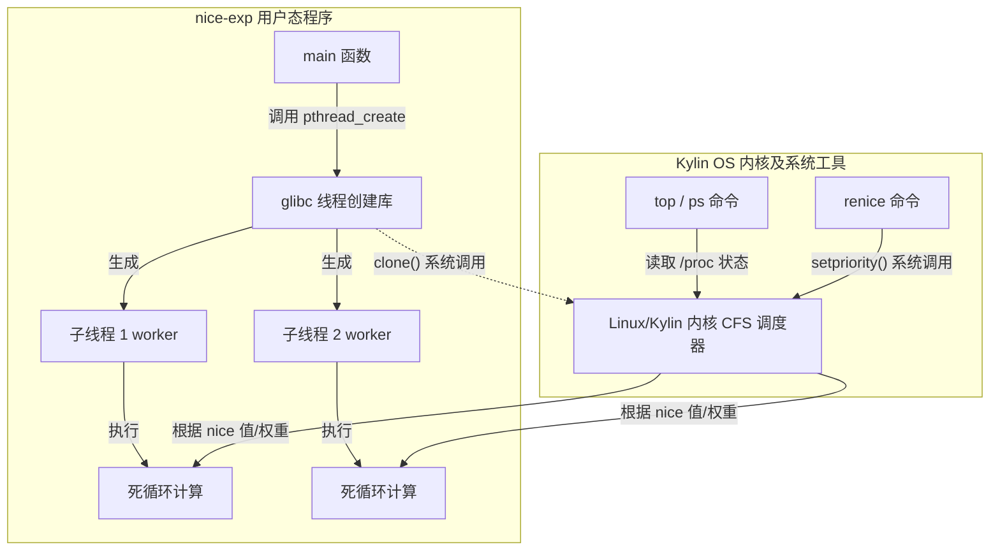
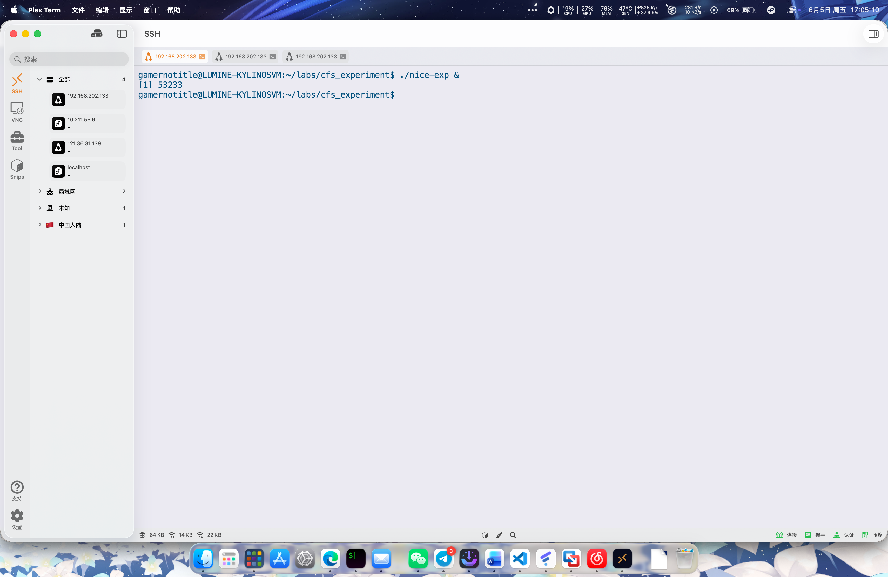
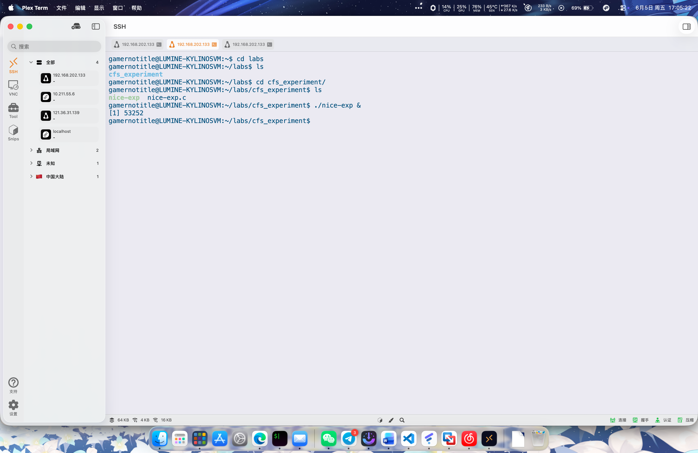
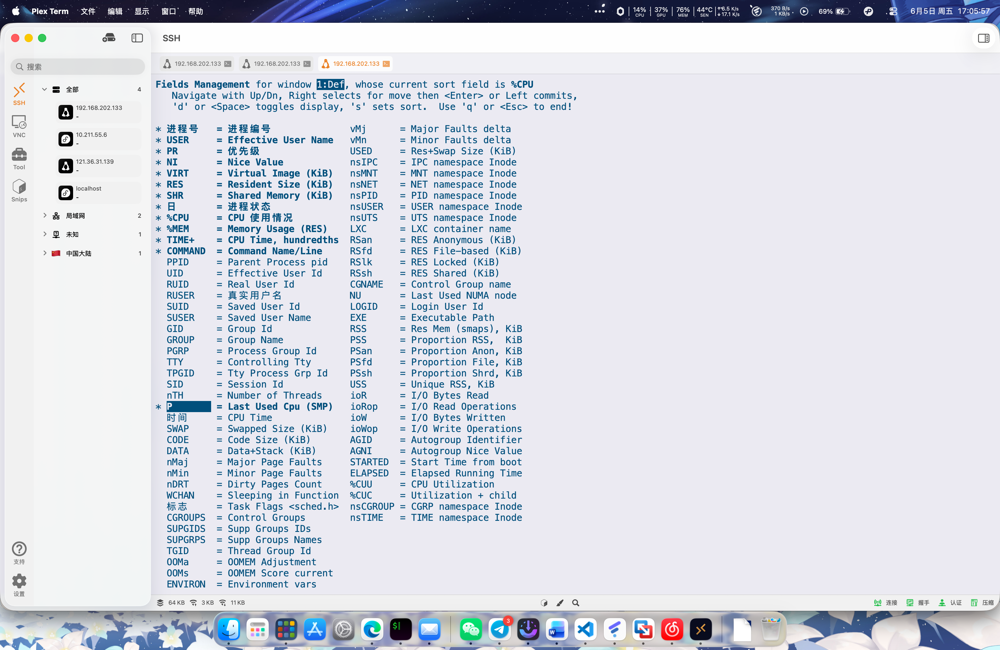
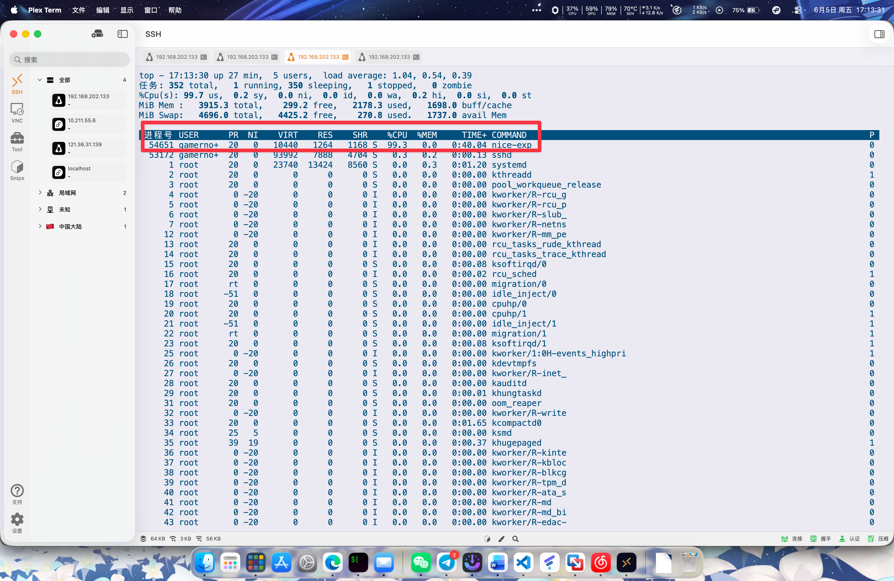
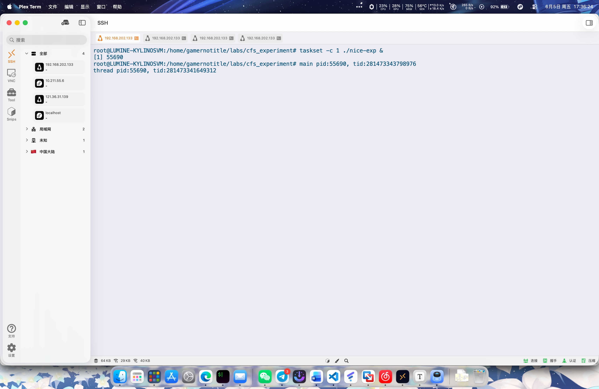
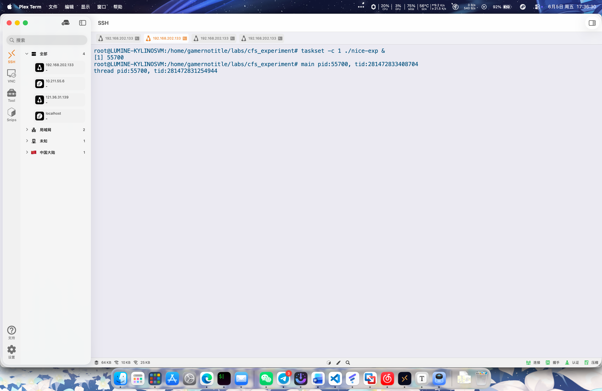
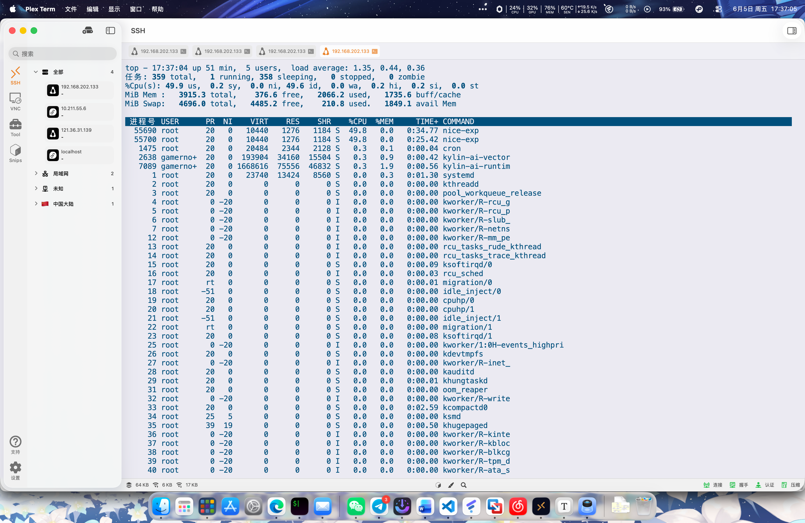
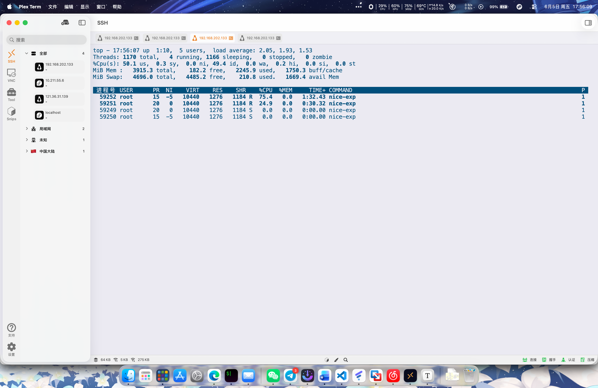

# 基于 Kylin OS 的进程调度与优先级实验

很简单，直接把这个源码编译一下运行截个图即可

## 实验目的

调度器是内核中最重要的一个模块，它来控制一个线程（也可以称之为一个任务）是否可以运行，何时开始运行，运行多长时间，以及在哪个CPU上运行。调度器主要有如下几种策略：

①完全公平调度策略CFS；

②基于FIFO和RR的实时调度RT策略；

③基于Deadline的实时调度策略。

④基于CPU算力和功耗的EAS调度策略。

本实验要求写一个简单的调度器

## 实验内容及要求

本实验要求写一个简单的调度器，实现调度器的基本功能。

## 实验设计方案及原理

操作系统的调度器核心原理可概括为：“管理任务状态，在特定的触发点（如时间片用尽或主动让出）根据特定算法选择下一个要运行的任务，并执行状态切换。”

一个简单的调度器通常包含以下四个核心要素：

**任务控制块（Task Control Block, TCB）**：用于描述和记录一个任务的全部静态和动态信息，是调度器识别、追踪和管理该任务的唯一依据。

**任务状态机（Task State Machine）**

在本实验中，任务的状态简化为四种：

- 就绪（READY）：任务已准备好，在队列中等待分配 CPU。

- 运行（RUNNING）：当前正在占用 CPU 执行。

- 阻塞（BLOCKED）：等待特定事件（如延时、I/O 等），暂时无法运行。

- 结束（TERMINATED）：任务运行完毕，等待回收资源。

**就绪队列（Ready Queue）：**用于存放所有处于 READY 状态的任务，调度器每次从中筛选出下一个执行的目标。

**时间片（Time Slice）与时钟滴答（Tick）**：系统通过周期性的硬件/模拟时钟中断（Tick）来递减当前运行任务的时间片。当时间片耗尽时，触发抢占式调度。

## 程序流程图



## 各程序之间的调用关系




## 疑难杂症

麒麟系统默认打开了运行保护，需要关一下，不然会说不允许的操作。采用命令 `sudo setstatus -f exectl off` 就好了，这样重启也可以运行。

## 程序运行结果

对程序进行运行，其中打开两个终端，均运行 `./nice-exp &`，再打开一个终端，运行 `top` 命令





在 `top` 页面中打开 `Last Used CPU (SMP)` 选项



可以看到 `nice-exp` 占用了大量 CPU



尝试将两个同样的进程绑定到同一个核心中，因为虚拟机只分配了 2 核，这里直接全部绑定到第二个核心上面去，运行 `taskset -c 1 ./nice-exp &`





再到另一个终端会话使用 `top` 查看



发现两个进程几乎各占用一半的 CPU 核心资源，尝试调整优先级

我们先获取两个 `nice-exp` 的 PID，运行 `pidof nice-exp`，发现分别为 `59250` `59249`


使用 `renice` 调整进程 `59250` 的优先级为 `-5`

```bash
$ sudo renice -n -5 -g 59250
```

再次在 `top` 查看，发现 CPU 占用比约为 3:1



## 结果分析及实验小结

可以发现，在死循环的线程作用下，nice-exp 程序占用了几乎全部 CPU 资源。在 top 视图下，CPU 占用为 99.3%。而经过优先级调整后，CPU 占用比变成了 3:1。验证了实验手册中的计算结果。

其实还有更简单的方法，直接起两个就好了，也不用那么麻烦一个一个点，说实话

```bash
$ taskset -c 1 nice -n 0 ./nice-exp &
$ taskset -c 1 nice -n -5 ./nice-exp &
```

直接这样可以起两个绑定在同一个核心上的进程。获取程序 pid 其实也不用 ps aux 慢慢找，用 pidof <process_name> 就可以（就像我上面那样）。
