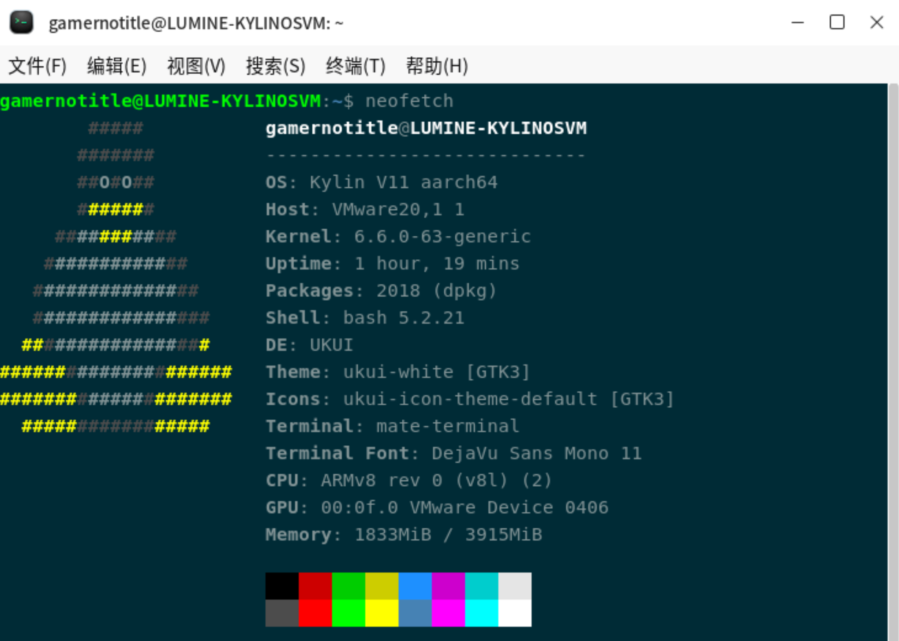

# OperationSystemExperiment

广东工业大学 2025-2026 学年计算机学院操作系统课程实验留档

## 实验内容

> [!important]
>
> 笔者班级要求在前四个分类中做 5 个实验（其中必须包含三个不同分类）即可优秀，所以这里只有我自己做过的
>
> 个人使用的电脑系统是 KylinOS v11
>
> 
>
> ```bash
> $ gamernotitle@LUMINE-KYLINOSVM:~$ uname -a
> Linux LUMINE-KYLINOSVM 6.6.0-63-generic #63-KYLINOS SMP Sat Feb  7 12:52:44 UTC 2026 aarch64 aarch64 aarch64 GNU/Linux
> ```

## 实验目录

- 实验和课程设计
    - 调度器
        - [基于 Kylin OS 的进程调度与优先级实验](./ProcessSchedule)
        - [实现 O(1) 调度器算法](./ScheduleAlgorithm/)
    - 内存管理 **(本节一律不做，不想在我的 Mac 上装 QEMU)**
        - 安装 QEMU 软件
        - 页表快照实验
        - slab 内存分配实验
        - 内存回收实验
    - 文件系统
        - [文件系统底层存储调试与扇区映射实验](./BlockMapping)
        - 简易文件系统设计实现及高级缓存功能开发
    - 银河麒麟高级服务器操作系统（工业版）管理
        - [多用户与权限管理](./MultiUser)
        - 文件快速定位与管理
        - 数据检索与处理
    - 银河麒麟适配迁移
        - 基于 DEB 格式的国产操作系统适配打包规范
        - 基于 RPM 格式的国产操作系统适配打包规范
    - 虚拟化技术与应用
        - 容器化负载均衡部署实践
        - 电商 web 大并发解耦解决方案
    - 课程设计要求
- 附录 银河麒麟高级服务器（工业版）V10 安装与初始化

