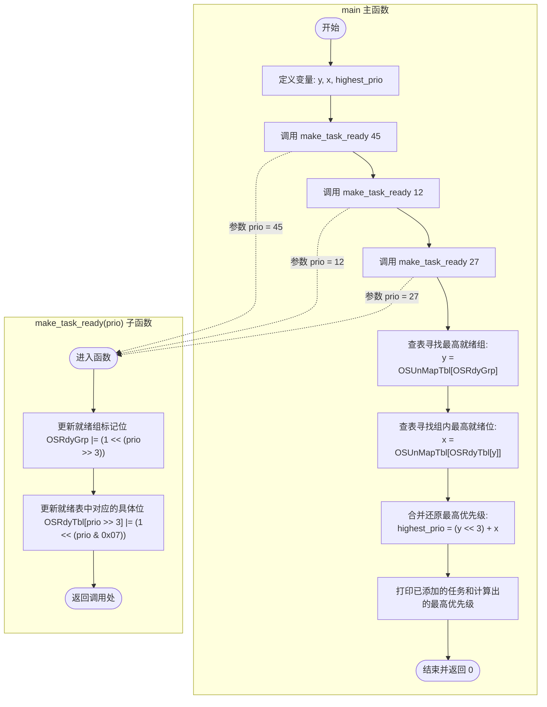
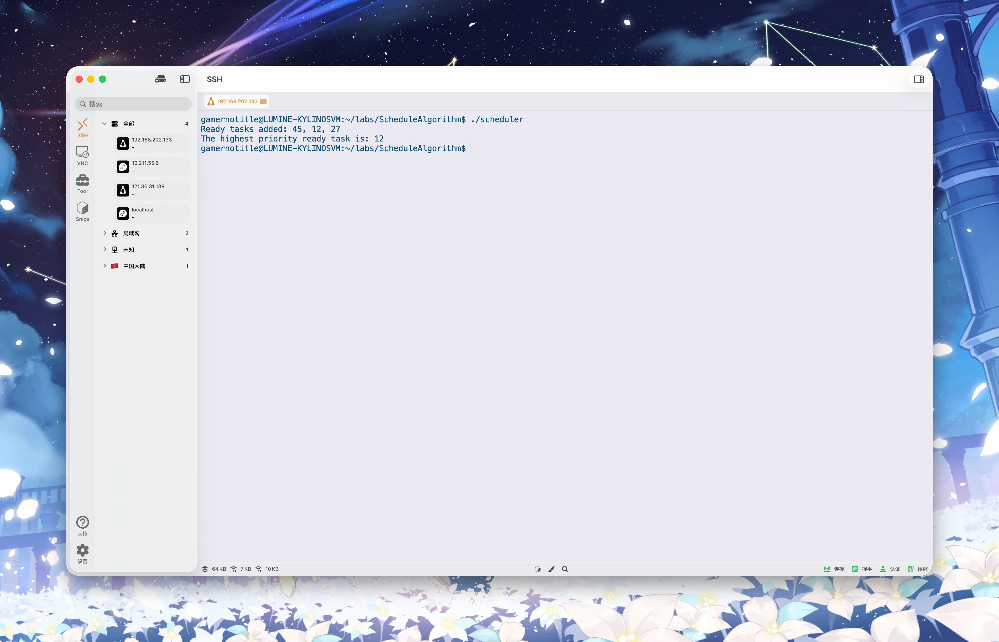

# 实现 O(1)调度器算法

## 实验目的

根据实验手册，实现给定的 O(1) 调度器算法。

## 实验内容及要求

编写查表法调度算法，核心机制是利用 `OSRdyGrp` 变量记录哪些任务组有就绪任务，利用 `OSRdyTbl` 数组记录具体哪个任务就绪，并结合一个预先计算好的 256 元素常量数组 `OSUnMapTbl` 来快速定位最低位的1

## 程序流程图

## 程序运行结果

可以看到，我们添加了优先级为 `45` `12` `27` 的三个任务，在其中经过调度后，优先级最高的任务是 `12`

## 结果分析与实验小结

在实验过程中，我们编写并运行了相关的 C 语言代码，对算法进行了实际验证

- 模拟向就绪表中添加了优先级为 45、12、27 的三个任务。
- 运行调度算法后，程序首先通过 `y = OSUnMapTbl[OSRdyGrp]` 锁定了最高优先级组为第 1 组，随后通过 `x = OSUnMapTbl[OSRdyTbl[y]]` 定位到该组内的偏移量为 4。
- 最终拼接计算得出最高优先级任务为 12。实验运行结果与理论预期完全一致，验证了调度逻辑的正确性。
